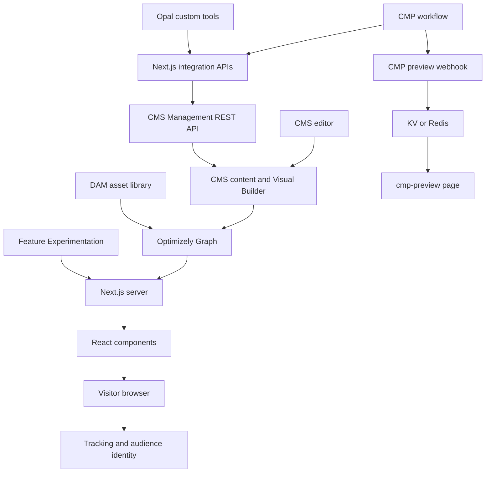

# 1. Architecture: Where Everything Comes From

[Contents](README.md) · [Next: Setup](02-setup.md)

## 1.1 What this project is

This is a configurable demo framework built with a Next.js frontend and Optimizely SaaS CMS. Its current brand is LF Stockholm. The `OT_` prefix is a historical naming convention, not a separate product or tenant. Renaming type keys without a migration can break mappings to existing CMS content.

[package.json](../../package.json) declares Next.js `16.2.6`, React `19.2.4`, TypeScript, Tailwind v4, CMS SDK/CLI `^2.2.0`, and Optimizely SDK `^6.3.0`. A `^` denotes a version range; the lockfile determines the installed exact version. Documentation for the installed Next.js version is under `node_modules/next/dist/docs/`. Read the project conventions before following older tutorials that introduce `pages/` or `middleware.ts`.

## 1.2 System map



The arrows show implemented data flows. They do not imply that every connection is active in a particular tenant.

## 1.3 Follow a public page request

Suppose a visitor opens `/sv/insurance`. This is an example URL; the corresponding CMS page must actually exist.

1. [proxy.ts](../../proxy.ts) handles request-level locale and visitor identity concerns.
2. `i18n/` and `lib/i18n/` resolve the active language. English public URLs omit `/en`; other language prefixes remain.
3. The [catch-all page](../../app/(site)/[...slug]/page.tsx) looks up CMS content by slug. The homepage has a [separate route](../../app/(site)/page.tsx).
4. [lib/optimizely.ts](../../lib/optimizely.ts) centralizes SDK initialization, request context, and content/settings fetching.
5. [lib/contentScope.ts](../../lib/contentScope.ts) restricts Graph queries to the site's origins, preventing another site's pages from being returned from a shared CMS instance.
6. If the experience has an `FxFlagKey`, an FX decision can select a CMS variation. Preview requests have their own draft path.
7. [CompositionRenderer](../../lib/CompositionRenderer.tsx) uses composition nodes and the registry to render the correct CMS adapter.
8. The adapter converts CMS fields, image URLs, display settings, and editor attributes into React props.
9. The UI component produces the page UI. Interactive parts run in client components.
10. Layouts add the theme, header, and footer. Routes and helpers also generate metadata and JSON-LD.

**Checkpoint:** Why can an editor change a CMS title without editing a React component? The component consumes data; the changed content arrives in the Graph response.

## 1.4 Learn the four layers through Hero

| Layer | Actual file | Responsibility |
|---|---|---|
| Content type | [OT_HeroBlock.ts](../../cms/content-types/OT_HeroBlock.ts) | Defines fields editors fill in: headline, body, CTA, image |
| Display template | [OT_HeroDefault.ts](../../cms/display-templates/OT_HeroDefault.ts) | Defines available layout, color, and animation choices |
| CMS adapter | [OT_HeroBlock.tsx](../../cms/components/OT_HeroBlock.tsx) | Maps CMS data to Hero props using `getPreviewUtils`, `pa`, and `src` |
| UI | [HeroBlock.tsx](../../components/blocks/HeroBlock.tsx) | Defines appearance and interaction |

A [styling mapper](../../cms/styling/OT_HeroBlock.styling.ts) handles typed display settings and defaults. The [registry](../../cms/registry.ts) registers content types, display templates, and React adapters.

Examples from the actual mapping:

```text
content.headline                   → HeroBlock.headline
content.primaryCtaLabel            → primaryCta.label
content.primaryCtaUrl.default      → primaryCta.href
src(content.visual)                → visualSrc
getHeroStyles(displaySettings)     → styleOptions
```

`primaryCtaUrl` is not necessarily a plain string: Graph can return a `ContentUrl` object, so the adapter reads its `default` field. CMS field names and React prop names do not have to match.

## 1.5 Composition versus fixed pages

```text
BlankExperience
└── Section (with an editor-friendly displayName)
    └── Row
        └── Column
            └── Component, such as OT_HeroBlock
```

Editors build a `BlankExperience` by arranging blocks. A `_page` type such as `OT_BlogPage` uses structured fields and a dedicated renderer. Registering a new `_page` type does not automatically create its targeted Graph query or route dispatch.

`cms/compositions/` contains Section, Row, Column, and SliderRow components. The custom renderer preserves composition metadata used by editor selection. Understand that behavior before replacing it with an SDK renderer.

## 1.6 Folder map

| Location | Read it when working on |
|---|---|
| `app/(site)/` | Public pages, blog index, showcase, and contact |
| `app/(draft)/`, `app/preview/` | Draft and standalone block previews |
| `app/api/` | CMP, CMS, Opal, forms, search, and admin endpoints |
| `app/opti-admin/` | Login and operator dashboard |
| `cms/content-types/` | Schemas and editorial field definitions |
| `cms/display-templates/` | Visual Builder styling/layout options |
| `cms/components/` | CMS adapters |
| `components/blocks/` | Reusable UI blocks |
| `components/layout/` | Header, footer, menu, and language selector |
| `lib/` | Graph, REST, formatting, storage, mapping, and business logic |
| `lib/fx/`, `lib/bq/`, `lib/demo/` | Experiments, BigQuery, and demo simulation |
| `styles/tokens.css`, `app/globals.css` | Default design values and Tailwind bindings |
| `scripts/` | Schema sync, demo content creation, and verification |
| `tests/` | Isolated routing regressions |

`(site)` and `(draft)` are route groups; these parenthesized names do not appear in public URLs. `page.tsx` defines a page; `route.ts` defines HTTP handlers.

## 1.7 Data ownership

| Data | Primary location |
|---|---|
| Page text, block settings, and theme content | CMS |
| Marketing workflows and structured content | CMP |
| Asset binaries and metadata | DAM |
| Published delivery projection | Graph index |
| Render code, schema definitions, and mappings | Git repository |
| Secrets, site origins, and integration enablement | Local/deployment environment |
| Preview payloads and CMP-to-CMS mappings | KV/Redis, with a local memory fallback |
| Flags, rules, and variation decision configuration | FX project |
| Demo event and product rows | BigQuery, when configured |

The Graph index is not the content-authoring source. If a field looks wrong on the website, check its CMS/CMP value, then the Graph response, then the adapter/UI.

## 1.8 Finding historical changes

This guide describes current wiring; it is not a commit-history audit. To find who changed a file and when, inspect its history:

```bash
git log --oneline -- lib/cmpBlog.ts
git log -p -- cms/content-types/OT_HeroBlock.ts
```

Changes made through CMS/CMP interfaces will not appear in Git. Inspect content version history, workflow history, and deployment configuration records separately.
