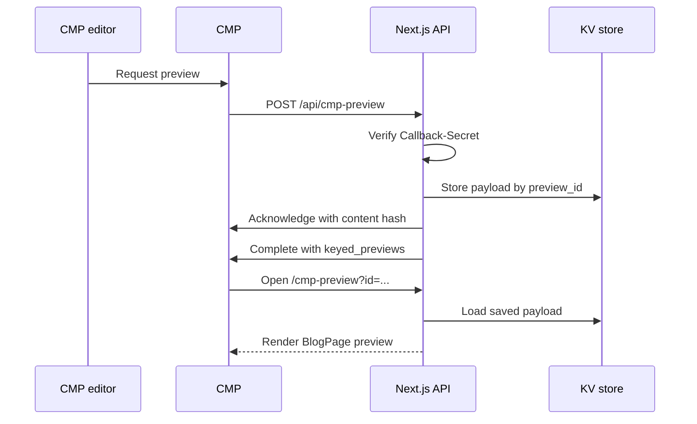

# 4. CMP and Opal: Code and Product Settings Together

[Contents](README.md) · [Next: Other features](05-features.md)

## 4.1 Two blog pipelines

| Concern | Opal article | CMP-imported article |
|---|---|---|
| Input | Title plus section descriptions | CMP structured-content fields |
| CMS type | `BlankExperience` | `OT_BlogPage` |
| Composition | Visual Builder section/block tree | Fixed page fields/rendering |
| Target variable | `CMS_BLOG_CONTAINER_KEY` | `CMP_BLOG_CONTAINER_KEY` |
| Initial status | Draft | Draft |
| Listing | `/blog` composition index | Typed `OT_BlogPage` feed path |
| Main mapper | `lib/blogComposition.ts` | `lib/cmpBlog.ts` |

The `/blog` index and `OT_BlogFeedBlock` do not run the same query. If a CMP article exists in the CMS but is missing from `/blog`, check the content-type/listing mismatch first. Decide which pipeline is intended before changing a schema or type to “fix” it.

## 4.2 CMP preview sequence

Creating a CMS draft is not a prerequisite for this project's CMP preview path. The [preview page](../../app/cmp-preview/page.tsx) maps the saved payload into the UI. Durable KV is needed because the webhook and preview rendering requests can reach different server processes. Preview entries currently expire after 24 hours in KV; that lifetime is separate from CMS preview-token expiry.

The official CMP protocol includes a request webhook, acknowledgement, and completion using `keyed_previews`. This project combines that protocol with its own stored-payload renderer. [Work with previews](https://docs.developers.optimizely.com/content-marketing-platform/docs/work-with-previews).

## 4.3 What to configure in CMP

Menu placement can vary by tenant UI and permissions. These steps identify the configuration objects and exact project contract. Check for an existing integration before creating another one.

1. **API application:** Obtain the CMP integration application's client ID/secret and set them in the server environment. The client must have the required API access.
2. **Structured-content model:** Use the field keys and compatible field types listed below. A display label and an API key are separate things.
3. **Preview integration/webhook:** Configure the HTTPS callback for `content_preview_requested` as `https://<site>/api/cmp-preview`.
4. **Publishing webhook/channel:** Configure the `asset_published` callback as `https://<site>/api/cmp-publish`. Confirm that the workflow publishes content to the intended destination/channel.
5. **Secret:** Use the same secret for both CMP callbacks and the deployment's `CMP_CALLBACK_SECRET`.
6. **Storage:** Configure KV/Redis REST credentials. A local memory fallback does not validate production preview or republish persistence.
7. **CMS target:** Verify the CMP blog container, CMS client credentials, content type, and content-item write permissions.
8. **Iframe:** Confirm that the deployment's `frame-ancestors` permits the CMP tenant origin. Relevant origins are configured in [next.config.ts](../../next.config.ts).

CMP's webhook contract specifies HTTPS callbacks, event subscriptions, and an optional secret. This project makes that secret mandatory: an unset secret returns 503; a mismatch returns 401. The official contract limits the secret to 32 characters, so use a 32-character random value for the CMP callback. [Webhook contract](https://docs.developers.optimizely.com/content-marketing-platform/reference/get-started).

## 4.4 Field mapping: why exact names matter

Source: [lib/cmpBlog.ts](../../lib/cmpBlog.ts).

| CMP API field key | Payload value | Website/CMS field |
|---|---|---|
| `headline` | `text_value` | Headline; falls back to asset title |
| `subHeadline` | `text_value` | Subheadline |
| `body` | `rich_text_value` | Rich-text HTML |
| `readTime` | `text_value` | Read time |
| `topic` | `choice_key` | Lowercase topic key |
| `featuredImage` | `asset_guid`, `links.self` | Preview asset URL / CMS image reference |

Fields come from `data.assets.structured_contents[0].content_body`. Preview payloads can use `fields_version`, while publishing uses `latest_fields_version`; the mapper accepts both. It prefers the primary locale in each field's localized array. Locales such as `en_US` are normalized to BCP-47 form for the CMS. The current mapper reads the first structured-content item; it is not a general-purpose multi-item/multi-author import engine.

**Practice:** Changing the CMP label “Headline” to “Article title” can leave the integration working if the API key remains unchanged. Changing the key from `headline` to `articleTitle` requires coordinated updates to `lib/cmpBlog.ts`, the schema contract, and test payloads.

## 4.5 Known acknowledgement contract mismatch

The current [CMP client](../../lib/cmpApi.ts) sends `acknowledgedBy` in its acknowledgement body. Its comment records that this worked against an earlier tenant. The current official API reference lists `acknowledged_by`. If a new tenant returns 422, inspect the response body and actual contract instead of blindly renaming the field based on this guide. [Acknowledge API](https://docs.developers.optimizely.com/content-marketing-platform/reference/acknowledgesccontentpreview).

The client obtains callback URLs from payload/response `links`. The vendor recommends following supplied links for related resources. [CMP REST overview](https://docs.developers.optimizely.com/content-marketing-platform/docs/open-api-introduction).

## 4.6 What CMP publishing actually does

1. The handler verifies the secret.
2. It maps the blog when `event_name === 'asset_published'`.
3. It looks up the previous CMS key in KV using `content_guid`.
4. Without a mapping, it creates an item; with a mapping, it attempts to update the same item with a new draft version.
5. It records the `cmsWrite` outcome in the response/captured delivery.
6. After a CMS editor reviews and publishes the draft, it can enter published Graph delivery.

Sources: [publish handler](../../app/api/cmp-publish/route.ts), [CMS REST writer](../../lib/cmsApi.ts), and [mapping store](../../lib/cmpPreviewStore.ts).

**A 200 response is not a sufficient success criterion.** `cmsWrite.status` can be `created`, `updated`, `skipped`, or `error`. Missing credentials/container or an unmappable payload can produce a skipped result. The preview handshake is also best-effort; inspect acknowledgement/completion logs even when the response is 200.

Republish mapping reduces duplicates, but the implementation does not provide locking or transaction guarantees for concurrent first deliveries. Losing KV data can lose the mapping and allow duplicate items. Test sequential repeats in the lab; define production delivery guarantees separately.

## 4.7 CMP acceptance test

1. Create test structured content with a unique headline.
2. Request a preview and inspect received, acknowledge, and complete statuses in logs.
3. Check the title, body, and image in CMP preview.
4. Publish through the configured workflow destination.
5. Check for `created` in `cmsWrite` and find the draft in the target CMS folder.
6. Edit and republish the same content; expect `updated` and the same CMS key.
7. Review/publish in the CMS, then verify the public article route and typed feed.

The current GET inspection handlers can return the latest payload and have no authentication guard of their own. Do not treat them as confidential-content dashboards; review the access boundary first. This is an observed implementation limitation, not a change made by this learning task.

## 4.8 Configure Opal tools

Custom project endpoints:

| Endpoint | Authentication | Purpose |
|---|---|---|
| `GET /api/opal/discovery` | Public | Tool manifest |
| `POST /api/opal/dam-images` | Bearer `OPAL_TOOL_SECRET` | Real DAM image keys |
| `POST /api/opal/create-blog` | Same bearer token | Creates an article draft |

Steps:

1. Configure the server's Opal secret, CMS credentials, and `CMS_BLOG_CONTAINER_KEY`, then redeploy.
2. Add a custom registry in Opal **Connectors → Registries**. Use `https://<site>/api/opal/discovery` as the discovery URL and configure the bearer token.
3. Under **Connectors → Tools**, confirm that `list_dam_images` and `create_blog_article` are Active and, for chat use, Enabled in Chat.
4. Import the `lf-stockholm-blog-articles` skill using the [project skill import guide](../opal-skills/README.md).
5. Bind the skill's Where to use setting to the intended CMS instance and configure keyword/intent activation. Importing a file does not automatically establish the tenant binding.
6. Prompt: “Create a test article draft for our site using a real DAM image.”
7. Inspect the raw tool result's `container`, open the CMS draft, and verify its sections/images in preview.

After changing the manifest, the current official workflow is **Connectors → Registries → More → Sync**. Older project notes recommend recreating the registry; try Sync first and verify the resulting tool list/schema. [Manage tools](https://support.optimizely.com/hc/en-us/articles/39329066565901-Manage-tools).

## 4.9 Opal section vocabulary

Supported section names: `text`, `steps`, `accordion`, `table`, `stats`, `quote`, `callout`, `image`, `imageText`, `gallery`, `banner`, `video`, `cards`, `links`, and `divider`.

This writer renders `stats` using cards rather than `OT_StatBlock` because of column-placement limitations. Unknown/malformed sections can be skipped, so review the rendered result after a successful API response. Draft-only creation is a project implementation/policy, not a universal limitation of all Optimizely Opal tools.

When adding a section type, update these together:

1. [blogComposition.ts](../../lib/blogComposition.ts): union and mapper.
2. [Discovery route](../../app/api/opal/discovery/route.ts): section documentation/schema contract.
3. [Section probe](../../scripts/emit_section_probe.mts): example coverage.
4. Opal skill instructions if needed, followed by registry Sync.

## 4.10 If CMS writes return 403

Receiving an OAuth token does not prove content-write permission. API scope and access to the target content tree are separate. Reading `/contenttypes` may succeed while creating content is forbidden. A wrong container can also place a valid draft under another site's tree. Verify the response body and returned container; do not share token or secret values in diagnostic output.
